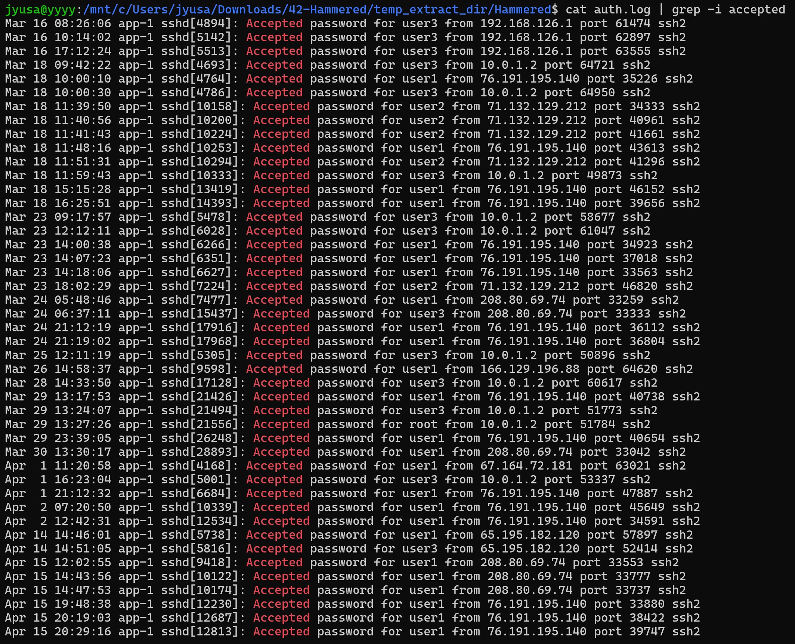
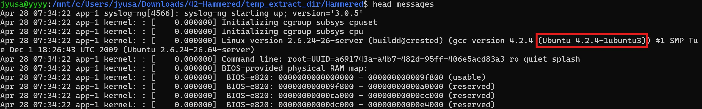
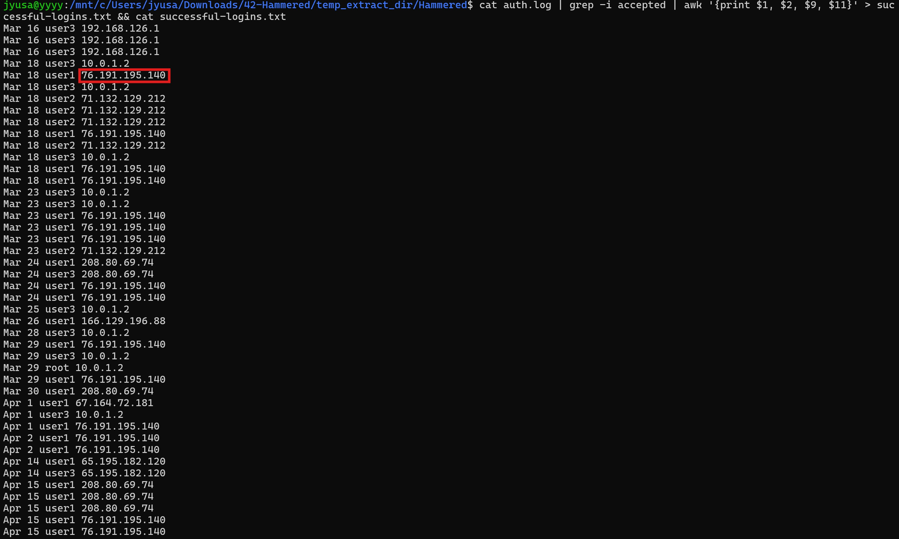
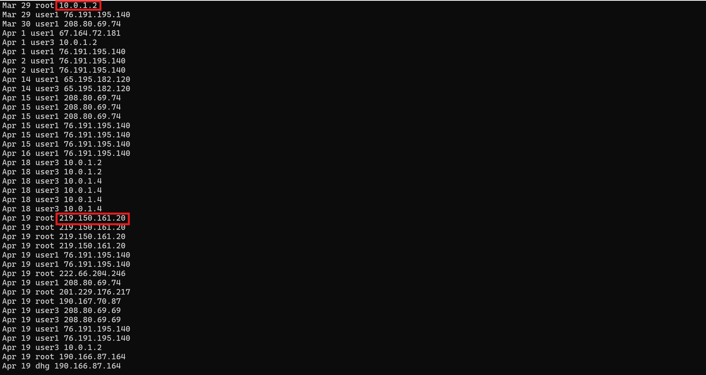
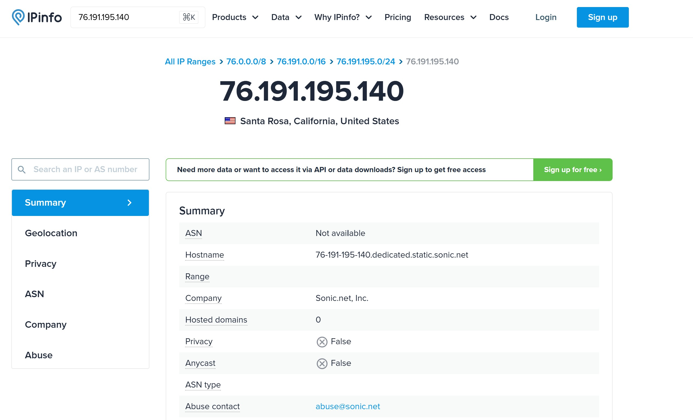
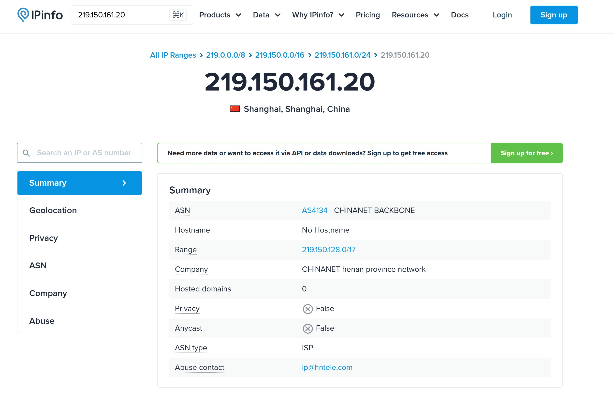

# Linux Log Analysis Lab - John Yang

## Objective

Today, I decided to try a SOC Analyst lab focused on simulating a real-world incident response scenario where I investigate suspicious activity on a compromised webserver honeypot by analyzing logs through Linux. I will be documenting my thought process and the actions that I took to navigate through the questions asked. My primary objective for this lab was to practice and brush up my skills in smoothly navigating through Linux's CLI and to further develop my attention to detail in endpoint forensics and log analysis.

### Skills Learned

- Performed endpoint forensics and in‑depth log analysis to uncover attackers' various tactics, techniques, and procedures (TTPs).
- Developed fluency in Linux command‑line navigation and file system management to efficiently locate and analyze key information, streamlining SOC operations.
- Gained extensive knowledge of the unique contents of different logs in Linux, such as auth logs, Apache access logs, and package manager logs.
- Applied open‑source intelligence (OSINT) techniques to gather and correlate external data for threat analysis.

### Tools Used

- Windows Subsystem for Linux (WSL, Ubuntu distribution)
- Linux command-line commands & tools
- Open-source intelligence (OSINT)
  
## Before we begin

Navigate to https://cyberdefenders.org/blueteam-ctf-challenges/hammered/, download the lab zip file and extract it on your device. Then, open the lab folder in the terminal.

Lets log in! We should be in the same directory as we were before.

Note that I used Windows Subsystem for Linux for this lab, but it is completely possible to do this with a virtual machine too.

Let's run ls -la to see all the information in our directory.

Now we're ready to begin!

## Questions

### Question 1: Which service did the attackers use to gain access to the system?

When dealing with attackers gaining access, it is most likely that they used valid credentials to bypass authentication. 

We can cat the auth.log file, and also we can pipe it with a grep to search for the word "accepted" to try to seek out successful authentications.

We can see sshd being used to gain access to the system.

Answer: **SSH**

### Question 2: What is the operating system version of the targeted system?

Going back to our directory and seeing its contents, we know that messages can contain information about system related events.

This time, instead of cat, I will use head to only output the first ten lines.

And there it is! We see the operating system that the targeted system is running.

Answer: **4.2.4-1ubuntu3**

### Question 3: What is the name of the compromised account?

To tackle this question we would need to go back to auth.log.

I used the same command from before, `cat auth.log | grep -i accepted`, but I just wanted to clear up some things on the output, so I used another pipe to chain `awk '{print $1, $2, $9, $11}'`

This only shows the information from the columns associated with the numbers, so I narrowed down the output to the month, date, user, and IP address, which I determined were key information.

Looking at the output, we can see that our first successful authentication from an external IP address was from 76.191.195.140 on the user1 account. We'll keep note of that.

Scrolling down further however, we see some more interesting information.

Here, we can see that our root account was accessed by a private IP on March 29. However, on April 19, we see that the account was accessed by an external IP address of 219.150.161.20.

To determine which account was the compromised one, I used some OSINT to find the geolocation of the two IP addresses in question.

So now we have the locations of the two IP addresses, but I made sure to not make quick judgements and investigate further.

Digging around in different logs, I viewed user.log, where the timezone of the device was set to America/Los Angeles, or Pacfic Standard Time.

Based on this information, we can finally deduct that the IP address from Shanghai was the more malicious one rather than the IP from Santa Rosa (a part of the same timezone), and that the compromised account was the root account.

Answer: **root**

### Question 4: How many attackers, represented by unique IP addresses, were able to successfully access the system after initial failed attempts?

First, I assumed that this question 

## Conclusion

Coming into this project, my knowledge of EDR and SOAR technologies was largely theoretical, coming from studying for courses and certifications. Actually getting to implement these systems, connect them through APIs, and design a complete workflow from detection to response was both eye-opening and incredibly rewarding. I was able to bridge the gap between abstract concepts and real-world application, and acquire a deeper appreciation for how modern security operations function. This project bolstered my enthusiasm for cybersecurity and desire to keep learning through hands-on experiences, and I definitely will be doing more projects like these. Thank you for reading!

## Contact

Email: <johnyang4406@gmail.com>, <john_s_yang@brown.edu>

LinkedIn: <https://www.linkedin.com/in/john-yang-747726292/>
