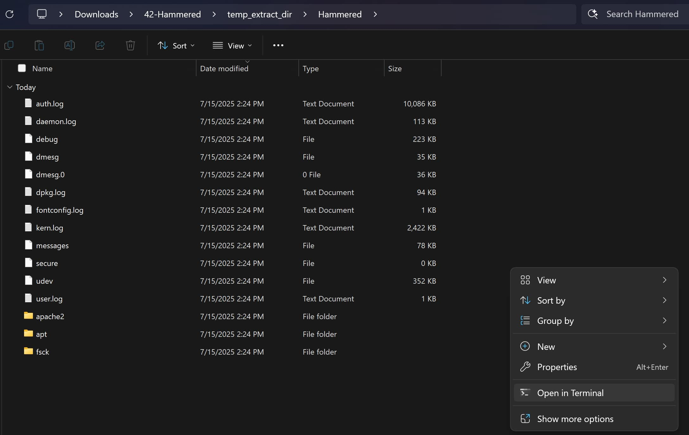
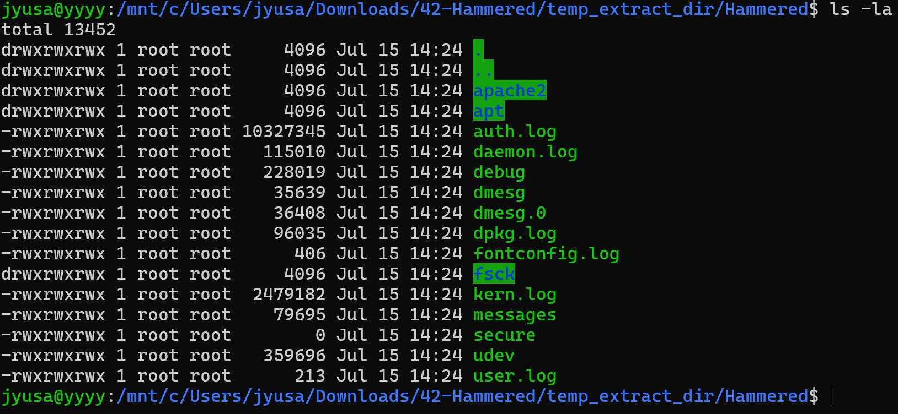

# Linux-Log-Analysis

## Objective

Today, I decided to try a SOC Analyst lab focused on simulating a real-world incident response scenario where I investigate suspicious activity on a compromised webserver honeypot by analyzing logs through Linux. I will be documenting my thought process and the actions that I took to navigate through the questions asked. My primary objective for this lab was to practice and brush up my skills in smoothly navigating through Linux's CLI and to further develop my attention to detail in endpoint forensics and log analysis.

### Skills Learned

- Performed endpoint forensics and in‑depth log analysis to uncover attackers' various tactics, techniques, and procedures (TTPs).
- Developed fluency in Linux command‑line navigation and file system management to efficiently locate and analyze key information, streamlining SOC operations.
- Gained extensive knowledge of the unique contents of different logs in Linux, such as auth logs, Apache access logs, and package manager logs.
- Applied open‑source intelligence (OSINT) techniques to gather and correlate external data for threat analysis.

### Tools Used

- Windows Subsystem for Linux (WSL, Ubuntu distribution)
- Linux command-line commands & tools
- Open-source intelligence (OSINT)
  
### Before we begin

Navigate to https://cyberdefenders.org/blueteam-ctf-challenges/hammered/, download the lab zip file and extract it on your device.

We can now open the lab directory in our terminal.

Lets log in!

Note that I used Windows Subsystem for Linux for this lab, but it is completely possible to do this with a virtual machine too.

We're in the directory! Let's run ls -la to see all the information in our directory. Now we're ready to begin.

### Questions

## Question 1

### Conclusion

Coming into this project, my knowledge of EDR and SOAR technologies was largely theoretical, coming from studying for courses and certifications. Actually getting to implement these systems, connect them through APIs, and design a complete workflow from detection to response was both eye-opening and incredibly rewarding. I was able to bridge the gap between abstract concepts and real-world application, and acquire a deeper appreciation for how modern security operations function. This project bolstered my enthusiasm for cybersecurity and desire to keep learning through hands-on experiences, and I definitely will be doing more projects like these. Thank you for reading!

## Contact

Email: <johnyang4406@gmail.com>, <john_s_yang@brown.edu>

LinkedIn: <https://www.linkedin.com/in/john-yang-747726292/>
