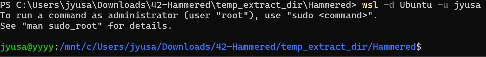

# Linux Log Analysis Lab - John Yang

## Objective

Today, I decided to try a SOC Analyst lab focused on simulating a real-world incident response scenario where I investigate suspicious activity on a compromised webserver honeypot by analyzing logs through Linux. I will be documenting my thought process and the actions that I took to navigate through the questions asked. My primary objective for this lab was to practice and brush up my skills in smoothly navigating through Linux's CLI and to further develop my attention to detail in endpoint forensics and log analysis.

### Skills Learned

- Performed endpoint forensics and in‑depth log analysis to uncover attackers' various tactics, techniques, and procedures (TTPs).
- Developed fluency in Linux command‑line navigation and file system management to efficiently locate and analyze key information, streamlining SOC operations.
- Gained extensive knowledge of the unique contents of different logs in Linux, such as auth logs, Apache access logs, and package manager logs.
- Applied open‑source intelligence (OSINT) techniques to gather and correlate external data for threat analysis.

### Tools Used

- Windows Subsystem for Linux (WSL, Ubuntu distribution)
- Linux command-line commands & tools
- Open-source intelligence (OSINT)
  
## Before we begin

Navigate to https://cyberdefenders.org/blueteam-ctf-challenges/hammered/, download the lab zip file and extract it on your device. Then, open the lab folder in the terminal.

Lets log in! We should be in the same directory as we were before.

Note that I used Windows Subsystem for Linux for this lab, but it is completely possible to do this with a virtual machine too.

Let's run ls -la to see all the information in our directory.

Now we're ready to begin!

## Questions

### Question 1: Which service did the attackers use to gain access to the system?

When dealing with attackers gaining access, it is most likely that they used valid credentials to bypass authentication. 

We can cat the auth.log file, and also we can pipe it with a grep to search for the word "accepted" to try to seek out successful authentications.

We can see sshd being used to gain access to the system.

Answer: **SSH**

### Question 2: What is the operating system version of the targeted system?

Going back to our directory and seeing its contents, we know that messages can contain information about system related events.

This time, instead of cat, I will use head to only output the first ten lines.

And there it is! We see the operating system that the targeted system is running.

Answer: **4.2.4-1ubuntu3**

### Question 3: What is the name of the compromised account?

To tackle this question we would need to go back to auth.log.

I used the same command from before, `cat auth.log | grep -i accepted`, but I just wanted to clear up some things on the output, so I used another pipe to chain `awk '{print $1, $2, $9, $11}'`

This only shows the information from the columns associated with the numbers, so I narrowed down the output to the month, date, user, and IP address, which I determined were key information.

Looking at the output, we can see that our first successful authentication from an external IP address was from 76.191.195.140 on the user1 account. We'll keep note of that.

Scrolling down further however, we see some more interesting information.

Here, we can see that our root account was accessed by a private IP on March 29. However, on April 19, we see that the account was accessed by an external IP address of 219.150.161.20.

To determine which account was the compromised one, I used some OSINT to find the geolocation of the two IP addresses in question.

So now we have the locations of the two IP addresses, but I made sure to not make quick judgements and investigate further.

Digging around in different logs, I viewed user.log, where the timezone of the device was set to America/Los Angeles, or Pacfic Standard Time.

Based on this information, we can finally deduct that the IP address from Shanghai was the more malicious one rather than the IP from Santa Rosa (a part of the same timezone), and that the compromised account was the root account.

Answer: **root**

### Question 4: How many attackers, represented by unique IP addresses, were able to successfully access the system?

We can assume that the account that we are dealing with is root, since we identified it as the compromised account from the last question.

Again, we grep the auth.log for accepted, but I narrowed the output down further by only asking for the IP address column.

From here, we can simply take the information from last time and only output the results that are unique.

We don't want to count all of those individually, lets just add a `wc -l` to our command.

We can see that the root account has been successfully accessed 18 times.

Answer: **18**

### Question 5: Which attacker's IP address successfully logged into the system the most number of times?

To figure this out, we start from what we previously had, but bundle up and count the IP addresses instead. We can use `uniq -c` for this, and further sort the occurences from greatest to least by piping the command with `sort -nr`.

We see that the same IP address from Shanghai, 219.150.161.20, has successfully accessed root the most amount of times.

Answer: **219.150.161.20**

### Question 6: How many requests were sent to the Apache Server?

Here, we want to cd over to our apache2 directory, then cat www-access.log, since that is where requests are logged.

From here, we can simply count up all of the results from the output that we have.

We see that the server has been requested 365 times.

Answer: **365**

### Question 7: How many rules have been added to the firewall?

I was not entirely sure where to find specific information about firewall rules in logs, but I knew that firewall rules can be configured using a command called iptables.

From this, I decided to grep for iptables on the entire directory using `*` at the end to search every log file and `-r` to recursively search so that other directories can be searched too.

We can see that a total of 6 firewall rules have been added to the firewall.

Answer: **6**

### Question 8: One of the downloaded files on the target system is a scanning tool. What is the name of the tool?

We can see all the packages that are installed on dpkg.log.

Lets cat the log file and see if anything is suspicious.

Scroling through the output, we find nmap!

Answer: **nmap**

### Question 9: When was the last login from the attacker with IP 219.150.161.20? Format: MM/DD/YYYY HH:MM:SS AM

To answer this question, we need to go back to auth.log.

We can grep for "accepted" again, but this time, also grep the specific IP address 219.150.161.20.

We see that the last login from the attacker was on Apr 19 05:56:05. Wait. How about the year?

Previously, when we looked at the apache access log, I caught that the last logged event was in 2010. Therefore, the year must be 2010!

Answer: 04/19/2010 05:56:05 AM

### Question 10: The database showed two warning messages. Please provide the most critical and potentially dangerous one.

Databases can be a part of a background service. Because of this, it might be worth it to check out the daemon log for its information on background services.

We can cat daemon.log and pipe a grep for "warning" to scan for all of the warning logs.

From here we see there are two SQL warnings, one being "mysql.user contains 2 root accounts without password!" and the other being "mysqlcheck has found corrupt tables".

In my opinion, the first warning is definitely more critical and potentially dangerous.

Answer: **mysql.user contains 2 root accounts without password!**

### Question 11: Multiple accounts were created on the target system. Which account was created on April 26 at 04:43:15?

In Linux, we can identify users that were created by searching for useradd. Lets do exactly that, the same way we did it on question 7.

We can see the account that was added on Apr 26 04:43:15.

Answer: **wind3str0y**

### Question 12: Few attackers were using a proxy to run their scans. What is the corresponding user-agent used by this proxy?

Similar to question 6, we can find information about requests on the apache access log. Lets navigate to the directory and cat the file.

We can see that the user agent is located on column 12. From this, we can pipe `awk` to only show the user agents, then pipe `sort` and `uniq` to see the each unique user agent that requested the server. 

Here we see somthing weird. Apple, Mozilla, and WordPress is familiar, but pxyscand? I used OSINT again to see what this could be.

We indeed see that pxyscand is a network proxy scanner!

Answer: **pxyscand/2.1**

## Conclusion

This lab was my first intensive activity using Linux, and I had the opportunity to apply the commands I learned while self-studying. Although I did have some trouble finding out about commands and their functionalities (scrolling through a lot of man pages), digging into a real, simulated event head-first taught me so much. I became comfortable chaining together different commands that I already knew or discovered during the lab to zero in on critical evidence on logs, and overall benefitted my attention to detail and problem-solving skills tremendously. Now, after finishing the lab, I gained a solid toolkit of additional Linux commands, knowledge about logs and their contents, analysis techniques, and most importantly, a mindset for tenacious investigation and streamlined troubleshooting, which I'm excited to bring to a real cybersecurity environment. More CTFs coming soon!

## Contact

Email: <johnyang4406@gmail.com>, <john_s_yang@brown.edu>

LinkedIn: <https://www.linkedin.com/in/john-yang-747726292/>
